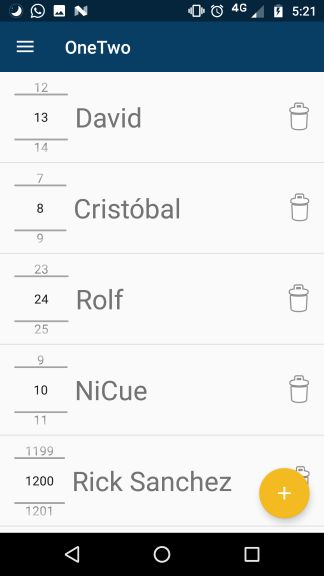
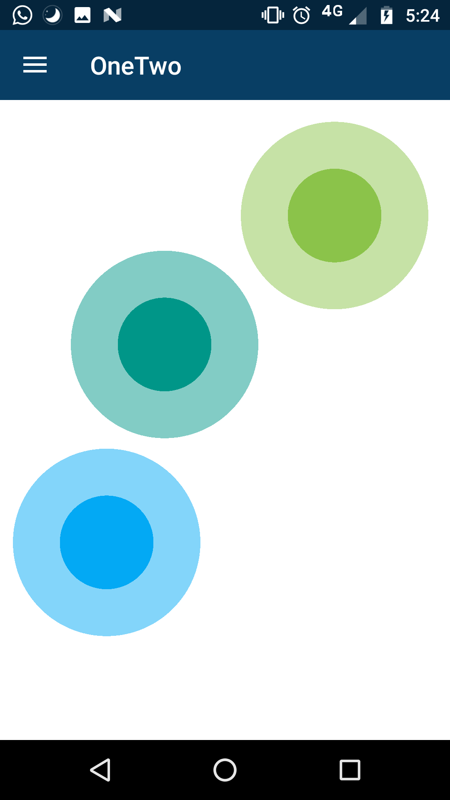

# OneTwo
#### OneTwo is a free Open Source Android app with tools to help you with your TableTop experience. That includes a Counter, Dices, Timers and an intuitive way to choose who starts!

## How to get it

There's three main ways to get OneTwo
* Get it on the [Play Store](https://play.google.com/store/apps/details?id=com.nicue.onetwo&hl=en)! It's free, no ads and it's stable
* Get it on [F-droid](https://f-droid.org/repository/browse/?fdfilter=onetwo&fdid=com.nicue.onetwo)
* Clone this repository and import it in Android Studio with "Import Project"

## How to Contribute
If you want to contribute to OneTwo, fill an Issue saying what would you like to change and if you want to be a contributor. Once you are a collaborator, you can commit and push, or do a pull request if you would like to!

## Screenshots

  

## License 
 
OneTwo is licensed under the MIT License
