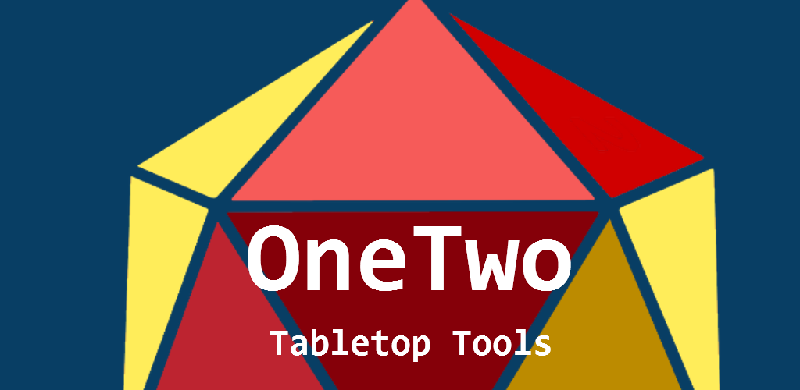
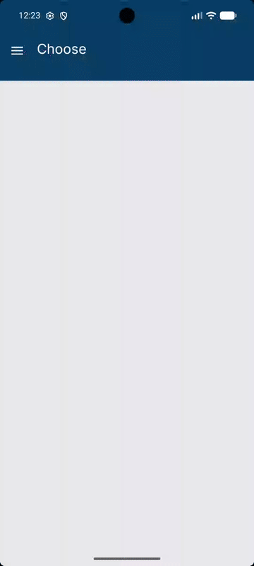
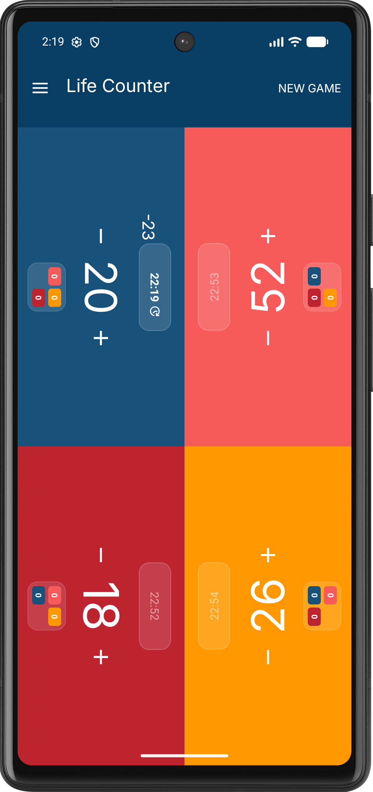
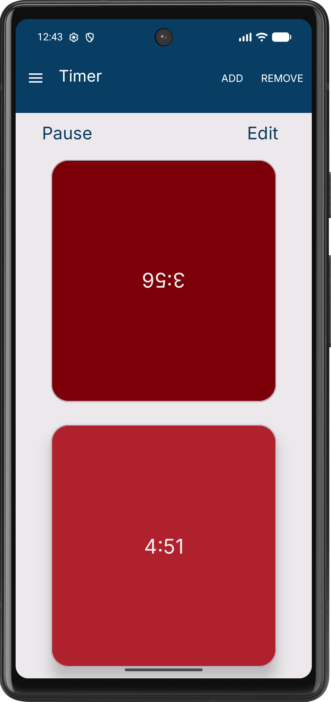
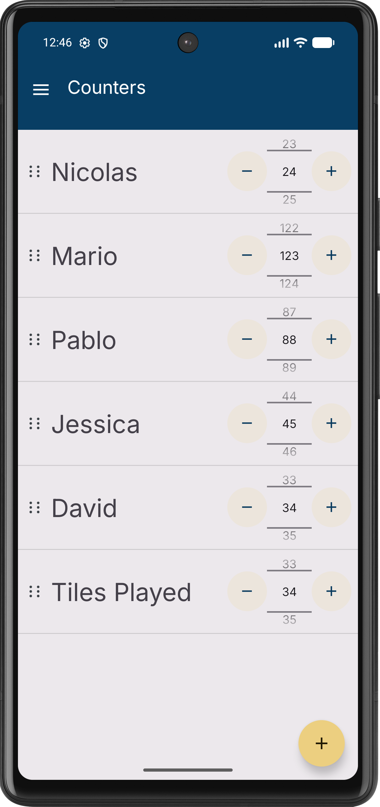
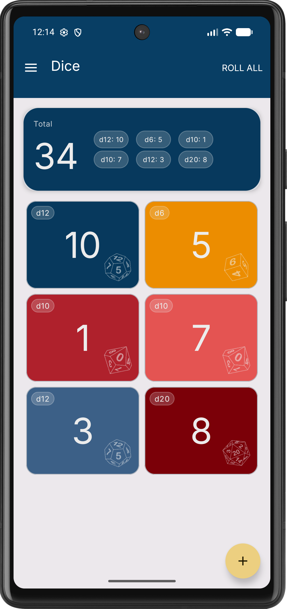

# OneTwo: TableTop Tools

OneTwo: TableTop Tools is a lightweight, fully open-source Android toolkit for tabletop games, board games, and trading card game (TCG) sessions. Built using clean architecture, native Java, and Material Design principles, it provides a distraction-free suite of utilities that stay out of the way of your game.

## Features

*   **MTG Life Counter:** Supports 1 to 6 players, full Commander damage matrix tracking (with automatic 21-damage highlight), sliding-window recent life total history, and an integrated per-player turn timer for MTG and Commander games.
*   **Intuitive Player Selector (Chooser):** An animated, multi-touch custom view (`TouchDisplayView`) that lets players place a finger on the screen to seamlessly determine who goes first or establish turn order.
*   **Custom Dice Roller:** Fully configurable dice rolling engine supporting edge-case selections from 2 faces up to 99,999 faces.
*   **Chess Timer:** A separate chess-style timer screen for board games, with synced game clocks handling up to 15 players simultaneously.
*   **Universal Counter:** Persistent trackers utilizing Room DB to record scores, life totals, or match points across multiple sessions.

---

## Download

| Platform | Link |
| :--- | :--- |
| **Google Play Store** | [Download Official Stable Release](https://play.google.com/store/apps/details?id=com.nicue.onetwo) |
| **F-Droid Archive** | [Get it on F-Droid](https://f-droid.org/repository/browse/?fdfilter=onetwo&fdid=com.nicue.onetwo) |

*Alternatively, you can clone this repository and compile the project directly via Android Studio using `Import Project`.*

---

## Tech Stack & Architecture

OneTwo is built as a highly testable, single-module (`:app`) native Android application adhering to modern separation of concerns.

*   **Language & Minimum SDK:** Java 21 / Compile & Target SDK 35 / Min SDK 21.
*   **UI Architecture:** Jetpack AndroidX Navigation framework, `AppCompat`, Material Components, and automated XML `ViewBinding`.
*   **State Preservation:** ViewModels paired with `SavedStateHandle` ensure that complex layouts (such as heavy MTG Commander tables) gracefully survive background process death and activity recreation.
*   **Data Layer:** Persistent storage is driven by **Room DB** (for structured table tracking) and a custom data source abstraction over **SharedPreferences** (for rapid serialization of game configs like dice arrays).
*   **Test Suite:** Decoupled business logic verified via unit tests leveraging `Robolectric`, `JUnit4`, and `LiveData` test utilities.

---

## Development & Workflow

### Common Gradle Tasks

Execute these commands from the repository root to verify build health, code quality, and formatting styles before submitting changes:

*   `./gradlew testDebugUnitTest` — Runs the local JVM and Robolectric test suite (Highly recommended after data or controller changes).
*   `./gradlew format` — Automatically formats changed Java, Gradle, Markdown, properties, and XML files.
*   `./gradlew formatCheck` — Evaluates project files for formatting adherence without changing them.
*   `./gradlew lintAll` — Runs Android lint alongside native Java Checkstyle compliance checks.
*   `./gradlew qualityCheck` — Combines formatting checks and linter suites into a single pass.

> **Note on JDK Versions:** While the codebase is configured for Java 21, local verification via Robolectric 4.11.1 framework shadow classes may fail to load under Temurin 25. It is highly recommended to strictly target **JDK 21** within your development environment when running your testing suite.

---

## Screenshots

  
  
  
  
  

---

## How to Contribute

Contributions, bug fixes, and localized translations are highly appreciated!

1. Open a new **Issue** detailing the feature you want to build or the bug you intend to squish.
2. Once discussed, you will be invited as a project collaborator to push changes, or you are welcome to fork the project and open a formal **Pull Request**.
3. Please run `./gradlew qualityCheck` locally before submitting code to ensure continuous integration pipelines pass smoothly.

## License

OneTwo is open-source software licensed under the **MIT License**. See the root code for details.
